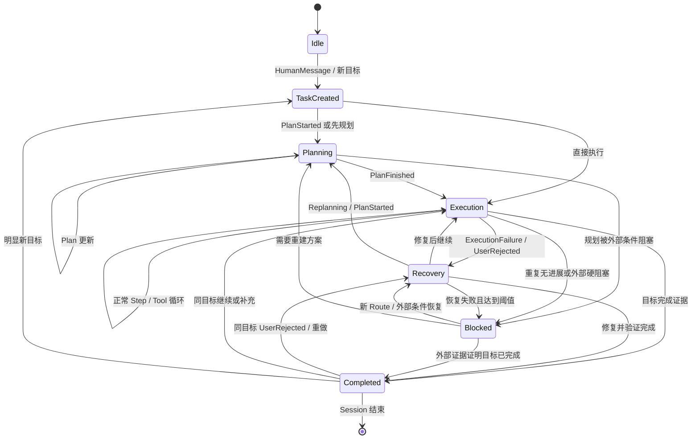

# ACU Router 状态机 v2：Session / Task / Routing Segment / Step

> 状态：基于原生协议实测的产品设计基线
> 版本：v2.0
> 日期：2026-07-28
> 依据：`02-native-protocol-observations.md`、`03-system-architecture.md`、`04-session-task-routing-segment-state-machine.md`
> 取代关系：本文取代旧 04 作为状态机规范；旧 04 保留为历史设计记录

## 1. 文档目标与边界

本文只定义 ACU Router 的领域模型、事件语义、状态转换和路由影响，回答：

1. 一段连续 Coding 工作如何归入 Conversation Session；
2. 一个用户目标如何形成 Task，并跨多个 Turn 延续；
3. 哪些连续工作共享一次难度判断和质量策略；
4. 一个 Agent Step 如何跨越模型响应、工具调用和工具结果；
5. Tool Failure、用户拒绝、Provider Error 和 Retry 如何改变状态；
6. 哪些事件重新 Judge、临时提高质量、允许升级或允许降级。

本文明确不设计：

- 微服务拆分；
- 数据库表、字段或索引；
- HTTP、内部 API 或回写接口；
- Provider Adapter 的具体协议转换；
- Judge Prompt 和数值模型；
- 计费与持久化实现。

## 2. v2 的实测事实基础

v2 只把以下已实测事实提升为设计约束：

1. Codex 0.145.0 通过重发并扩展 Responses Item 历史维持连续性；实测链路不依赖 `previous_response_id`。
2. Codex 的 `function_call.call_id` 与 `function_call_output.call_id` 构成 Tool 因果链。
3. Claude Code 2.1.220 通过增长的 Messages 历史以及 `tool_use.id` / `tool_result.tool_use_id` 维持连续性。
4. Claude `tool_result` 位于 `role=user`；同一个 `role=user` content 还可能同时含 Tool Result 和 Text。
5. Codex 实际 `update_plan` 是 Planning 强信号；仅声明该 Tool 不是强信号。
6. Claude Plan-only 指纹与实际 `ExitPlanMode` 是 Planning 强信号；批准后修改工具恢复是 Execution 组合信号。
7. Continue、增加约束、换任务、重做和不满意都会以新的外部输入进入增长的历史，但它们不必然属于新 Task。
8. Codex 可按 Thread 跨工作目录 Resume；Claude Code 的本地 Session 查找在实测版本中受项目目录约束。
9. New API 会删除 Claude Session Header，因此 ACU 不能依赖该 Header 作为全链路主键。
10. Retry 可在客户端和 New API 多层发生；一个逻辑动作可能产生多个 Provider Attempt。

因此，以下关系不成立：

```text
HTTP Request = Human Turn = Step = Provider Attempt
```

v2 使用四个独立层级：

```text
Conversation Session
└── Task
    ├── Turn
    └── Routing Segment
        └── Step
            ├── Model Response
            ├── Tool Call / Tool Result
            └── Attempt / Retry Attempt
```

## 3. 核心术语与不变量

### 3.1 Conversation Session

用户围绕一个或多个相邻目标进行连续工作的时间范围。Session 是连续工作周期，不等于单个聊天窗口、单个 HTTP 连接、单个客户端进程或单个 Task。

### 3.2 Task

一个用户目标级任务，例如“修复登录 Bug”。Task 可以包含多个 Human Turn、多个 Routing Segment、多个 Step，以及 Planning、Execution、Recovery 等不同阶段。

### 3.3 Turn

从一个已确认的 HumanMessage 开始，到下一个 HumanMessage 或 Task 终止之前的 Agent 工作区间。Turn 是理解人机交互的观察边界，不是路由锁定边界。

一个 Turn 可以包含多个 Step 和多个原生 API 请求；Agent 自动循环产生的新请求不会创建 Human Turn。

### 3.4 Routing Segment

Task 内共享同一难度认知、质量策略和默认模型锁定的一段连续工作。Segment 是 ACU 的核心路由单位。

### 3.5 Step

一个语义完整的 Agent 行动循环：一次逻辑 Model Response，加上该 Response 发出的 Tool Call，以及这些 Call 对应的 Tool Result。没有 Tool Call 的终局 Model Response 也构成一个 Step。

Step 不绑定 API Request。

### 3.6 Attempt

一次实际 Provider 调用。Provider Error 或网关 Retry 可以使同一个 Step 产生多个 Attempt。只有被接受为该 Step 逻辑 Model Response 的成功 Attempt，才推进 Step 的模型输出阶段。

### 3.7 不变量

1. 一个 Task 在任一时刻最多只有一个活动 Routing Segment。
2. 一个 Routing Segment 只有一份不可变的难度评估引用和质量策略快照。
3. 一个 Routing Segment 默认锁定模型与能力配置，并保存首选 Execution Profile；普通 Step 不重新选模型。
4. 同一 Segment 内只允许保持或升级，不允许自动降级。
5. RetryAttempt 不创建 Task、Turn、Segment 或 Step。
6. ToolResult 不等于 HumanMessage，即使协议 Role 是 `user`。
7. ProviderError 不等于模型能力不足。
8. 新 HumanMessage 默认重新 Judge，但不默认新建 Task。
9. Resume 不默认新建 Task，也不允许静默复用过期 Segment。
10. 无法高置信度证明连续性时，宁可拆分并重新 Judge，不错误继承低质量 Route。

### 3.8 显式模型边界

本文的“重新 Judge、升级、降级”规则适用于 `acu-auto` / `acu-high`。用户显式指定模型时仍识别 Session、Task、Segment、Step 和 Event，但：

- 不运行 ACU Judge；
- HumanMessage 可以创建新的 Segment，但不改变用户指定模型；
- ExecutionFailure、UserRejected 和 ProviderError 仍改变 Task 状态并形成 Evidence；
- 不自动用其他模型替代显式模型；
- RetryAttempt 仍只增加 Attempt。

这样 v2 不改变 03 已确认的显式模型产品边界。

## 4. Conversation Session 模型

## 4.1 定义

Conversation Session 表示一个用户连续工作周期，可以包含：

- 一个或多个相关或连续出现的 Task；
- 多个客户端进程；
- Continue / Resume；
- 中断后的恢复；
- 同一工作目标下的 Planning、Execution、Recovery；
- 短暂空闲。

Session 不以 `previous_response_id` 是否存在为前提，也不以工作目录是否相同为充分条件。

## 4.2 Session 连续性信号

按可信度从高到低使用组合证据。

### 强信号

1. 可信入口身份相同，且原生历史构成精确增长前缀；
2. Tool Call 与 Tool Result 的 ID 因果关系连续；
3. Codex 经版本门控验证的 Thread / Session Header 组合，与历史前缀一致；
4. 显式 Resume 指向已知客户端 Session，并重建出一致历史。

### 中等信号

1. 较长规范化历史前缀一致；
2. 同一 Task 目标、System/Developer 指纹和 Tool Schema 指纹一致；
3. 相同客户端项目范围，且时间间隔在 Session 租约内。

### 弱信号

1. 仅同一用户或 API Key；
2. 仅工作目录相同；
3. 仅时间相近；
4. 仅请求模型或工具列表相同；
5. 仅 Claude Session Header——因为当前 New API 实测会删除它。

弱信号不能单独合并 Session。

## 4.3 Session 生命周期

Session 状态：

- `active`：最近 30 分钟内有可归属的有效活动；
- `dormant`：30 分钟空闲租约已过期，但历史仍可被 Resume；
- `closed`：用户明确结束工作周期，或后续产品规则明确关闭；
- `ambiguous`：收到疑似延续输入，但证据不足，等待按安全规则拆分。

生命周期：

```text
不存在
  → active
  → dormant
  → active      # 高置信度 Resume
  → closed
```

`dormant` 不是删除，也不表示其中 Task 自动 Completed。

## 4.4 30 分钟续租规则

默认 Session idle lease：

```text
30 分钟
```

仅 ACU 可观察且可归属到该 Session 的有效语义活动续租：

- HumanMessage；
- 被接受的 Model Response；
- ToolCall；
- ToolResult；
- PlanStarted / PlanFinished；
- ExecutionFailure / UserRejected；
- Provider 调用或 Streaming 仍在进行；
- 明确属于当前 Session 的 Resume 请求。

以下事件不单独续租：

- `/models` 等能力探测；
- Health Check；
- 未归属的重放流量；
- 已完成请求的重复传输；
- 单纯由网关内部产生、没有活动 Provider 调用的计时器；
- 与 Task 无关的后台管理事件。

客户端本地执行 Tool 时，ACU 可能长时间不可见。若 30 分钟内没有任何可观察事件，Session 进入 `dormant`；后续 ToolResult 仍可依靠 Call ID 和历史前缀 Resume 原 Session。

## 4.5 Resume 行为

Resume 分为两层：

### Session Resume

若强连续性证据成立：

- `dormant → active`；
- 保留原 Session；
- 保留原 Task 历史和能力升级下限；
- 不因为客户端进程重启或 cwd 变化创建新 Session。

若只有弱证据或历史发生冲突：

- 不合并旧 Session；
- 创建新的 Conversation Session；
- 将疑似关联仅作为 Judge Evidence，而非事实关联。

### Route Resume

无论 Session 是否仍 active，Resume 都不得静默复用一个已过期的 Routing Segment：

- Segment 路由租约仍有效且 Resume 只恢复未完成 Tool 循环时，可以复用；
- Segment 租约过期或 Session 曾 dormant 时，关闭旧 Segment，创建 `resume` Segment，并重新 Judge；
- Retry 一个未完成 Provider Attempt 不属于 Resume，而属于同一 Step 的 RetryAttempt。

## 5. Task 模型

## 5.1 定义

Task 是用户目标级任务，例如：

```text
“修复登录 Bug”
```

Task 的身份来自目标连续性，而非请求 ID、单个 Prompt、工作目录或模型。

一个 Task 可以包含：

- 初始 HumanMessage；
- “继续”；
- 新约束；
- 重做；
- 用户不满意；
- 多个 Planning / Execution / Recovery 阶段；
- 多个 Turn、Segment、Step 和 Attempt；
- 中断和 Resume。

## 5.2 Task 边界

### 创建新 Task

满足以下任一条件时创建新 Task：

1. Session 中没有活动或可恢复 Task；
2. HumanMessage 明确提出与当前目标无关的新目标；
3. 用户明确 Reset、开始新任务或切换项目目标；
4. 历史前缀与 Tool 因果链均不连续，无法安全归入现有 Task；
5. 已 Completed Task 后出现明显不同的新目标。

### 延续同一 Task

以下通常延续当前 Task，但会形成新的 Human Turn 和 Routing Segment：

- “继续”；
- 为原目标增加约束；
- 要求重做同一目标；
- 明确表示上一结果不满意；
- 要求执行已完成的 Plan；
- 对同一目标补充验收条件。

以下内部事件延续当前 Task，且通常不创建 Turn：

- ToolCall / ToolResult；
- Agent 自动继续；
- 测试、Build、Lint 结果；
- Provider Retry；
- Planning 内部更新。

### 工作目录变化

工作目录变化只作为辅助 Evidence：

- Codex 实测可跨 cwd Resume，因此 cwd 变化不是新 Task 强信号；
- Claude Code 实测本地会话发现受 project scope 约束，但这描述客户端查找行为，不定义 ACU Task 边界。

## 5.3 Task 生命周期状态

本文使用以下 Task 状态：

- `Idle`：Session 中没有活动 Task；
- `TaskCreated`：目标已建立，尚未进入 Planning 或 Execution；
- `Planning`：正在形成或更新行动方案；
- `Execution`：正在执行模型动作和工具循环；
- `Blocked`：高置信度证据表明当前策略无法继续，或必须等待外部条件；
- `Recovery`：正在修复失败、采用升级策略或从阻塞中恢复；
- `Completed`：目标已有完成证据，当前无未解决阻塞。

`Completed` 可被同目标的新 HumanMessage 重新打开；历史 Completed 事实不被删除。

## 5.4 Human Turn

HumanMessage 创建新的 Turn。Turn 记录用户意图类型：

- `continue`；
- `constraint_added`；
- `goal_changed`；
- `redo`；
- `rejection`；
- `completion_request`；
- `unknown`。

Turn 不锁定模型。它首先触发 Task 归属判断，再决定创建哪个 Routing Segment。

## 6. Routing Segment 模型

## 6.1 定义

Routing Segment 是 Task 中共享以下内容的一段连续工作：

- 同一难度评估；
- 同一质量策略；
- 同一 Task 基础质量偏好；
- 同一能力升级下限；
- 同一阶段临时覆盖；
- 默认锁定的同一模型与能力配置，以及首选 Execution Profile；
- 同一允许的升级边界。

Segment 内的难度评估和质量策略不可变。需要改变这些事实时，必须结束当前 Segment 并创建新 Segment。

## 6.2 Segment 开始条件

以下事件开始新 Segment：

1. `TaskCreated`：Task 的首个 Segment；
2. `HumanMessage`：包括“继续”、新约束、重做和同目标补充；
3. `PlanStarted`：进入 Planning 或 Recovery 中重新 Planning；
4. `PlanFinished`：Planning Segment 结束，进入新的 Execution Segment；
5. `UserRejected`：旧结果被否定，进入 Recovery Segment；
6. `ExecutionFailure` 使 Task 从 Execution 进入 Recovery；新 Recovery Segment 继承难度评估，默认保持模型，不必重新 Judge；
7. Recovery 成功并回到正常 Execution；新 Execution Segment 撤销 Recovery 临时覆盖；
8. 高置信度 `ExecutionFailure` 累积为 Blocked；
9. Resume 时旧 Segment 租约已过期，或 Session 曾进入 dormant；
10. Provider 恢复必须改变实际模型或不兼容条件，创建 availability-recovery Segment；
11. 当前 Segment 的质量策略、能力下限或阶段覆盖必须改变；
12. Task 从 Completed 被同目标输入重新打开。

新 Segment 可以：

- 运行新的 Judge；
- 继承最近 Judge Evaluation，但创建新的质量策略快照；
- 在仅可用性恢复时不重新 Judge，只继承难度和质量下限。

因此，“创建 Segment”和“运行 Judge”不是同一个动作。

## 6.3 Segment 结束条件

当前 Segment 在以下条件下结束：

- 被新 HumanMessage 替代；
- PlanStarted 或 PlanFinished 引起阶段边界；
- ExecutionFailure 使 Execution 进入 Recovery；
- Recovery 成功并返回正常 Execution；
- 高置信度能力阻塞；
- UserRejected；
- Task Completed；
- Segment 路由租约过期；
- Provider 恢复需要改变锁定模型；
- 硬兼容条件变化，当前 Profile 无法继续；
- Task 被明确放弃或切换；
- Session 关闭。

结束原因必须表达语义，例如：

- `human_input`；
- `planning_started`；
- `planning_finished`；
- `execution_failed`；
- `recovery_finished`；
- `capability_blocked`；
- `user_rejected`；
- `lease_expired`；
- `availability_recovery`；
- `task_completed`；
- `task_switched`。

## 6.4 Segment 路由租约

Session 的 30 分钟 idle lease 与 Segment 的路由租约是两个概念。

Segment 默认 Routing Lease：

```text
10 分钟
```

作用：防止长时间不可见活动后无条件复用旧难度和模型。

以下已归属活动续租：

- Model 请求或有效 Streaming；
- Model Response 完成；
- ToolCall；
- ToolResult；
- 当前 Task 的 HumanMessage。

如果本地 Tool 执行期间 10 分钟没有网关可见活动，下一次请求到达时：

- Session 可能仍在 30 分钟 active lease 内；
- 旧 Segment 标记 lease expired；
- 创建新 Segment；
- 重新 Judge；
- ToolResult 的 Call ID 仍用于关联原 Task 和原 Step。

系统不按定时器后台 Judge，只在新可处理事件到达时检查租约。

## 6.5 Segment 内路由锁定

默认行为：

- 后续普通 Step 使用锁定的模型、能力配置和首选 Execution Profile；
- ToolCall、正常 ToolResult、Agent 自动继续不重新选模型；
- 第一次 ExecutionFailure 不自动升级；
- RetryAttempt 使用同一逻辑 Route，除非 Provider 可用性规则要求恢复。

允许在 Segment 内改变的只有：

- 同一模型、同一能力配置下的 Provider Attempt；
- 同一模型、等价配置下的健康 Channel 切换；
- 不改变难度与质量策略的运行参数修复。

若必须切换模型，结束当前 Segment并创建新 Segment。这样 Segment 的“默认模型锁定”才具有可审计语义。

## 6.6 质量目标

Task 维护：

```text
effective_quality_target = max(
  task_base_quality_target,
  capability_escalation_floor,
  temporary_phase_override
)
```

- `task_base_quality_target`：用户模式的基础偏好；
- `capability_escalation_floor`：高置信度能力阻塞形成的 Task 内最低下限；
- `temporary_phase_override`：Planning、Recovery 等阶段性临时覆盖。

这些值在 Segment 创建时形成快照。Segment 活动期间不原地修改快照。

## 7. Step 模型

## 7.1 Step 的语义边界

Step 是一个 Agent 行动循环：

```text
逻辑 Model Response
  → 0..N ToolCall
  → 每个 ToolCall 对应 0..1 ToolResult
  → Step closed / interrupted / unresolved
```

两类合法 Step：

### Tool Step

Model Response 发出一个或多个 ToolCall；对应 ToolResult 返回后，当前 Step 闭合。客户端随后携带这些结果请求下一个 Model Response，后者属于下一个 Step。

### Terminal Step

Model Response 不发 ToolCall，直接给出答案、计划、错误说明或完成声明。响应完成时 Step 闭合。

## 7.2 Step 与 API 请求的关系

不得假设一对一：

- 一个请求可能重发多个历史 Step；
- 一个 Step 的 ToolCall 和 ToolResult 通常跨多个请求出现；
- 一个模型响应的 Streaming 事件属于同一 Step；
- 一个请求可携带上一 Step 的 ToolResult，并开始下一 Step 的模型生成；
- Retry 可使同一 Step 产生多个相同或相近请求；
- Client Resume 会重发历史，但不会重建新的历史 Step。

Step 识别必须依赖新增历史增量、Tool ID 因果关系和成功 Model Response，而不是请求序号。

## 7.3 Step 生命周期

Step 状态：

- `awaiting_model`；
- `model_streaming`；
- `awaiting_tool_result`；
- `closed`；
- `failed`；
- `cancelled`；
- `unresolved`。

转换：

```text
awaiting_model
  → model_streaming
  → awaiting_tool_result   # 有 ToolCall
  → closed                 # ToolResult 齐全

model_streaming
  → closed                 # 无 ToolCall 的终局响应
  → failed                 # 不可恢复 Provider/Protocol 错误
  → cancelled              # 客户端取消

awaiting_tool_result
  → closed
  → unresolved             # Session 中断或 Result 长期缺失
```

## 7.4 多 Tool Call

同一 Model Response 中并行或批量产生的 ToolCall 属于同一 Step。Step 只有在以下任一条件满足时闭合：

- 所有可观察 ToolCall 都已有匹配 ToolResult；
- 客户端明确取消未完成 Call；
- Task / Session 被关闭，剩余 Call 标记 unresolved。

## 7.5 Retry 与 Step

RetryAttempt 是同一 Step 内新的 Attempt，当且仅当它重试相同逻辑模型动作。

Retry 不创建新 Step的条件：

- 没有新的 HumanMessage；
- 没有新的 ToolResult；
- 目标与历史增量相同；
- Retry 由 Client、New API、ACU 或 Provider SDK 的错误恢复触发。

若 Retry 后请求加入新约束、ToolResult 或新的规划内容，则它不再只是 Retry，应按相应 Event 推进 Step 或 Segment。

## 8. Event 模型

Event 是状态机的事实输入，不等于原始协议对象。协议 Normalization 可以从一个原始请求中产生零个、一个或多个 Event。

每个 Event 至少表达：

- Event 类型；
- 发生时间；
- 归属 Session / Task 候选；
- 来源协议与客户端版本；
- 关联的 Step、Tool ID 或 Attempt；
- 证据强度；
- 原始协议证据引用；
- 是否为重放或重复事件。

## 8.1 HumanMessage

定义：已高置信度识别为人类新输入的语义内容。

Codex：来自增长历史中新出现的人类 message，而不是 `function_call_output`。

Claude：必须先从 `role=user` content 中结构化剥离 `tool_result`；剩余 Text 只有在客户端历史增量、Turn 边界和来源规则支持时才能标记为 HumanMessage。

同一 Claude content 可以同时产生：

- 一个或多个 ToolResult；
- 一个 HumanMessage；
- 或 ToolResult 加无法确认来源的附加 Text。

无法确认的 Text 不应伪造 HumanMessage，也不应直接触发用户拒绝规则。

状态影响：创建 Human Turn；判断新 Task或延续 Task；默认结束旧 Segment、创建新 Segment并重新 Judge。

## 8.2 ToolCall

定义：Model Response 请求客户端执行的结构化工具动作。

关联键：

- Codex：`call_id`；
- Claude：`tool_use.id`。

状态影响：归入当前 Step；正常 ToolCall 不创建 Segment、不重新 Judge，并为后续 ToolResult 建立强因果关系。

## 8.3 ToolResult

定义：与既有 ToolCall ID 匹配的执行结果。

关联键：

- Codex：`function_call_output.call_id`；
- Claude：`tool_result.tool_use_id`。

状态影响：归入发出该 Call 的 Step；正常结果推进或闭合 Step，不创建 Human Turn。`is_error=true` 或确定性失败结果可进一步产生 ExecutionFailure。

## 8.4 PlanStarted

定义：存在高置信度 Planning 开始证据。

强证据：

- Codex 实际调用 `update_plan` 创建或重建计划；
- Claude 进入已版本门控的 Plan-only 模式；
- Recovery 中再次出现新的实际 Plan Tool，表示 Replanning。

弱证据如 Tool Schema 声明、出现单词 plan、连续 Read/Search 不单独产生 PlanStarted。

状态影响：Task 进入 Planning；结束当前 Segment；创建 Planning Segment；重新 Judge；施加 Planning 临时质量权重。

## 8.5 PlanFinished

定义：存在高置信度 Planning 完成并准备执行的证据。

强证据：

- Claude 实际 `ExitPlanMode`；
- Codex 实际 Plan 状态全部完成，并出现执行转移证据；
- Plan-only Tool 集退出，修改工具恢复且开始实际调用。

状态影响：结束 Planning Segment，创建 Execution Segment，撤销 Planning 临时覆盖。默认继承最近难度评估，不强制再次 Judge；若完成的 Plan 暴露重大新范围、约束或能力需求，则重新 Judge。

## 8.6 ExecutionFailure

定义：执行、验证或 Tool 结果显示当前动作未达到目标。

示例：

- 测试或 Build 失败；
- Tool 参数或命令失败；
- 文件/符号不存在；
- 修改后错误仍存在；
- 权限或环境阻塞。

ExecutionFailure 必须带失败来源与标准化 Failure Signature。

状态影响分级：

1. 首次失败：进入 Recovery，创建继承原难度评估的新 Recovery Segment，默认保持模型，不重新 Judge；
2. Recovery 中失败签名变化或明确有进展：复用 Recovery Segment，不重新 Judge；
3. 相同核心失败重复且无进展：累积能力阻塞 Evidence；
4. 达到高置信度阈值：Task 进入 Blocked，结束 Segment，重新 Judge，只允许保持或升级；
5. 明确环境错误：可进入 Blocked 等待外部条件，但不提高模型能力下限；
6. Provider/协议错误不使用本事件，分别归 ProviderError 或兼容性证据。

## 8.7 UserRejected

定义：HumanMessage 明确否定当前结果或要求重做同一目标，例如“还是不行”“理解错了”“重新做”。

UserRejected 同时也是 HumanMessage，但状态机只执行一次合并后的拒绝动作，避免双重 Segment。

状态影响：

- 保持同一 Task，除非用户同时提出明显新目标；
- Task 进入 Recovery；
- 当前 Segment 结束；
- 创建 rejection-recovery Segment；
- 重新 Judge；
- 临时提高质量和风险规避权重；
- 允许升级，不允许低于 Task 能力下限。

用户拒绝本身不是模型永久能力失败。只有结合重复失败或错误理解证据，才提高 capability escalation floor。

## 8.8 ProviderError

定义：429、5xx、Timeout、Overload、网络中断或 Provider 可用性错误。

状态影响：

- 记录失败 Attempt；
- 不改变 Task 难度；
- 不产生 Human Turn；
- 不重新 Judge；
- 不增加模型能力失败计数；
- 可在同一 Segment 内重试相同 Profile或切换等价 Channel；
- 若必须换模型，创建 availability-recovery Segment，继承难度和质量下限，不自动降级。

## 8.9 RetryAttempt

定义：同一逻辑模型动作因错误恢复产生的新增 Provider Attempt。

Retry owner 可以是 Client、New API、ACU 或 Provider SDK；owner 不改变事件语义。

状态影响：

- 归入原 Step；
- Attempt 计数增加；
- 不创建 Turn、Task、Segment或Step；
- 不重新 Judge；
- 不改变质量权重；
- 不把复用的 Client Request ID 当作幂等事实；
- 达到总 Attempt Budget 后产生最终 ProviderError，而不是无限重试。

## 9. Task 状态转换图



主路径可简化为：

```text
Idle
  ↓
TaskCreated
  ↓
Planning（可选）
  ↓
Execution
  ↓
Blocked（仅高置信度阻塞）
  ↓
Recovery
  ↓
Completed
```

`ExecutionFailure` 不必每次都进入 Blocked。普通可修复失败先进入 Recovery；重复无进展、能力不足或外部硬阻塞才进入 Blocked。

## 10. 状态转换规则

| 当前状态           | Event / 条件                | 下一状态    | Segment 动作                                 | Judge               |
| ------------------ | --------------------------- | ----------- | -------------------------------------------- | ------------------- |
| Idle               | HumanMessage 新目标         | TaskCreated | 创建首 Segment                               | 是                  |
| TaskCreated        | PlanStarted                 | Planning    | 创建 Planning Segment                        | 是                  |
| TaskCreated        | 直接执行                    | Execution   | 首 Segment进入执行                           | 已有首 Judge        |
| Planning           | Plan 更新                   | Planning    | 复用 Planning Segment                        | 否                  |
| Planning           | PlanFinished，无新能力需求  | Execution   | 新 Execution Segment，撤销临时覆盖           | 否，继承 Evaluation |
| Planning           | PlanFinished，范围/能力变化 | Execution   | 新 Execution Segment                         | 是                  |
| Execution          | 正常 ToolCall/ToolResult    | Execution   | 复用 Segment                                 | 否                  |
| Execution          | 首次可修复 ExecutionFailure | Recovery    | 新 Recovery Segment，继承难度并默认保持模型  | 否                  |
| Recovery           | 新修复策略，有进展          | Recovery    | 复用 Recovery Segment                        | 否                  |
| Recovery           | 修复成功，恢复正常执行      | Execution   | 新 Execution Segment，撤销 Recovery 临时覆盖 | 否                  |
| Execution/Recovery | 重复无进展达到阈值          | Blocked     | 结束 Segment                                 | 是                  |
| Blocked            | 新 Route 可用               | Recovery    | 新 Recovery Segment                          | Judge结果已产生     |
| 任意活动状态       | UserRejected                | Recovery    | 新 rejection Segment                         | 是                  |
| 任意活动状态       | ProviderError               | 原状态      | Retry/等价 Channel；换模型才新 Segment       | 否                  |
| 任意活动状态       | RetryAttempt                | 原状态      | 不变                                         | 否                  |
| Execution/Recovery | 完成证据                    | Completed   | Segment completed                            | 否                  |
| Completed          | 同目标继续                  | Execution   | 新 Segment                                   | 是                  |
| Completed          | 同目标拒绝/重做             | Recovery    | 新 Segment                                   | 是                  |
| Completed          | 明显新目标                  | TaskCreated | 新 Task首 Segment                            | 是                  |
| 任意活动状态       | Segment Lease过期后有新事件 | 按事件决定  | 新 resume Segment                            | 是                  |

## 11. 重新 Judge 规则

## 11.1 必须重新 Judge

1. 新 Task 创建；
2. 高置信度 HumanMessage，包括“继续”和新增约束；
3. UserRejected 或明确要求重做；
4. PlanStarted，包括 Recovery 中的 Replanning；
5. PlanFinished 且 Plan 暴露重大新范围、约束或能力需求；
6. 重复 ExecutionFailure 达到高置信度能力阻塞阈值；
7. Segment Routing Lease 过期后恢复；
8. dormant Session Resume；
9. 连续性证据冲突但仍尝试关联旧 Task；
10. Task 从 Completed 被重新打开。

Judge 必须读取完整 Task 状态，不得只评估短输入“继续”或“重做”。

## 11.2 默认不重新 Judge

1. 正常 ToolCall；
2. 正常 ToolResult；
3. Agent 自动继续；
4. 普通 Model Response；
5. 第一次 ExecutionFailure；
6. Failure Signature 已变化或明确改善；
7. ProviderError；
8. RetryAttempt；
9. Plan 内部状态更新；
10. PlanFinished 且没有能力需求变化；
11. 同模型等价 Channel 的可用性恢复。

## 12. 路由策略影响矩阵

| Event                              | 重新 Judge                 | 临时提高质量权重                     | 允许升级                     | 允许降级                             |
| ---------------------------------- | -------------------------- | ------------------------------------ | ---------------------------- | ------------------------------------ |
| HumanMessage：继续/补充            | 是                         | 否，除非内容要求                     | 是，按新 Evaluation          | 仅新 Segment 且不低于能力下限        |
| HumanMessage：明显新目标           | 是，新 Task                | 由新 Task决定                        | 是                           | 是，新 Task重置旧 Task能力下限       |
| ToolCall                           | 否                         | 否                                   | 否                           | 否                                   |
| ToolResult：成功                   | 否                         | 否                                   | 否                           | 否                                   |
| ToolResult：首次失败               | 否                         | 新 Recovery Segment 临时提高风险权重 | 暂不自动                     | 否                                   |
| PlanStarted                        | 是                         | 是，Planning override                | 是                           | 否                                   |
| PlanFinished，无新需求             | 否                         | 撤销 Planning override               | 保留已有升级                 | 是，仅因临时覆盖结束且不低于能力下限 |
| PlanFinished，有新需求             | 是                         | 按新阶段                             | 是                           | 仅新 Segment 且 Judge支持            |
| ExecutionFailure：首次或有进展     | 否                         | Recovery Segment 临时提高            | 可保持                       | 否                                   |
| ExecutionFailure：重复无进展       | 是                         | 是                                   | 是，只保持或升级             | 否                                   |
| UserRejected                       | 是                         | 是，rejection/recovery override      | 是                           | 否                                   |
| ProviderError                      | 否                         | 否                                   | 只允许可用性恢复到等质或更高 | 否                                   |
| RetryAttempt                       | 否                         | 否                                   | 否                           | 否                                   |
| Resume：Segment Lease有效          | 否，若仅恢复未完成Tool循环 | 否                                   | 否                           | 否                                   |
| Resume：Lease过期或Session dormant | 是                         | 否                                   | 是                           | 仅新 Segment且不低于能力下限         |
| Task Completed                     | 否                         | 全部临时覆盖结束                     | 不适用                       | 不在活动 Segment内降级               |

## 12.1 临时提高质量权重

临时覆盖用于阶段风险，不等于永久能力升级：

- Planning：提高全局理解、架构一致性和长程推理权重；
- Recovery：提高错误诊断、验证严谨性和避免重复策略权重；
- UserRejected：提高需求重读、反证、验证和风险规避权重。

临时覆盖在新 Segment 创建时生效，在阶段结束时撤销。

## 12.2 允许升级

允许升级不等于必然升级。升级由 Judge 和质量策略决定。

自动升级需要以下之一：

- 新 Judge 认为目标难度或不确定性提高；
- Planning / Replanning 需要更高全局一致性；
- 重复同类 ExecutionFailure 且没有进展；
- UserRejected 与错误理解/重复失败证据共同出现；
- 当前 Profile 不满足新工具、上下文或协议硬条件；
- Provider 可用性恢复只能选择不低于当前质量下限的更高 Profile。

能力型升级会提高 `capability_escalation_floor`；纯阶段临时提高和 Provider 恢复不会。

## 12.3 允许降级

同一 Segment 内禁止自动降级。

仅以下 Segment 边界允许重新选择较低 Profile：

1. PlanFinished 后撤销 temporary override；
2. 新 HumanMessage 创建新 Segment，Judge 确认后续工作更简单；
3. dormant Session Resume 后重新 Judge；
4. 新 Task 创建，旧 Task 的 capability floor 不继承；
5. Recovery 已结束且新 Segment 的有效质量目标下降。

任何降级都不得低于当前 Task 的：

```text
max(task_base_quality_target, capability_escalation_floor)
```

ProviderError、RetryAttempt、成本压力、一次成功 ToolResult 都不能单独触发降级。

## 13. Failure、Blocked 与 Recovery

## 13.1 Failure 不等于 Blocked

ExecutionFailure 是事件；Blocked 是 Task 状态。

第一次失败通常表示正常 Agent 反馈循环：

```text
Execution
  → ExecutionFailure
  → Recovery
  → 新策略
  → Execution
```

只有以下高置信度证据才进入 Blocked：

- 同一 Failure Signature 连续至少两次且策略无有效变化；
- 测试/Build 核心错误连续无改善；
- 已明确目标不存在但模型重复访问同一虚构目标；
- 修改—撤销—重复修改形成振荡；
- UserRejected 与重复失败或错误理解共同出现；
- 外部条件明确使任务无法继续。

## 13.2 环境阻塞

权限、缺少依赖、磁盘、端口、测试环境等可以使 Task 进入 Blocked，但：

- 不重新解释为模型能力不足；
- 不提高 capability escalation floor；
- 外部条件恢复后进入 Recovery；
- 若模型反复错误处理同一环境事实，才另行产生能力阻塞 Evidence。

## 13.3 Provider 错误

ProviderError 默认不改变 Task Phase。它只影响 Attempt 与可用性恢复：

```text
ProviderError
  → RetryAttempt（预算内）
  → 同模型等价 Channel
  → 必要时 availability-recovery Segment
  → 无合格候选则返回 Provider 失败
```

不因 ProviderError 提高任务难度，也不把 429/5xx/Timeout 计入能力失败次数。

## 14. Planning 状态规则

## 14.1 Codex

强开始信号：实际 `update_plan` 创建或重建计划。

强更新信号：后续实际 `update_plan` 更新同一计划状态。

强结束组合：计划项完成，并出现进入实现或验证的行为。仅 Tool Schema 中存在 `update_plan` 不产生 PlanStarted。

复杂任务没有 `update_plan` 时，状态保持 Execution 或 unknown，不推断强 Planning 状态。

## 14.2 Claude Code

强开始信号：版本门控的 Plan-only System/Tool-set 指纹。

强结束信号：实际 `ExitPlanMode`。

Execution 组合信号：修改工具恢复并被实际调用。

Prompt 文案和 Tool 集不能按全文永久硬编码，必须按客户端版本识别信号族。

## 14.3 Replanning

Replanning 使用 `PlanStarted` Event 表达，但带 `reason=replanning`。它发生在：

- Recovery 中旧方案被证伪；
- Blocked 后需要新方案；
- PlanFinished 前计划被重大更新或重建；
- 用户拒绝原方案并要求重新规划。

Replanning 总是创建新 Planning Segment并重新 Judge。

## 15. Completed 判定

模型自述“完成”不是唯一完成事实。Task 进入 Completed 需要组合证据，例如：

- Terminal Model Response 声明目标完成；
- 所有 ToolCall 已闭合或明确取消；
- 计划项已完成；
- 相关 Test / Build / Verification 通过；
- 没有未解决的高置信度 Failure；
- 用户明确接受结果。

并非每个 Task 都具备测试。没有机器验证时，可以依据终局响应和无未解决阻塞进入 Completed，但标记较低完成置信度。

Completed 后：

- “继续”可能重新进入 Execution；
- “还是不行”进入 Recovery；
- 新目标创建新 Task；
- Retry 旧 Provider 请求不得重新打开 Task。

## 16. 端到端领域场景

### 场景 A：Codex 正常 Tool 循环

```text
HumanMessage“修复登录 Bug”
→ TaskCreated + 首次 Judge + Execution Segment
→ Model Response(function_call call_1)
→ ToolCall(call_1)
→ ToolResult(call_1)
→ Step 1 closed
→ 下一 Model Response
→ Step 2
```

Responses 历史被重发不创建重复 Step；通过历史增量和 `call_id` 去重。

### 场景 B：Claude user Role 混合内容

```text
role=user content=[tool_result(toolu_1), text(...)]
→ 先产生 ToolResult(toolu_1)
→ 再判断 text 来源
→ 只有高置信度人类文本才产生 HumanMessage
```

不得先看到 `role=user` 就创建 Turn、Segment或Judge。

### 场景 C：“继续”

```text
HumanMessage“继续”
→ 延续原 Task
→ 新 Turn
→ 结束旧 Segment
→ 新 Segment + Judge
→ Judge 读取完整 Task / Plan / Failure / 当前 Profile
```

### 场景 D：Planning 到执行

```text
PlanStarted
→ Planning Segment + Judge + 临时覆盖
→ 多个 Plan Step 复用 Route
→ PlanFinished
→ 结束 Planning Segment
→ 新 Execution Segment
→ 无新能力需求：继承 Evaluation，不重新 Judge
```

### 场景 E：测试首次失败并修复

```text
ExecutionFailure(signature A, first)
→ Recovery
→ 新 Recovery Segment，继承难度并保持模型
→ 不重新 Judge
→ 当前模型提出新修复
→ 测试错误改善
→ 修复验证成功
→ 新 Execution Segment，撤销 Recovery 临时覆盖
→ Execution
```

### 场景 F：重复失败导致能力阻塞

```text
ExecutionFailure(signature A)
→ Recovery
→ ExecutionFailure(signature A, no progress)
→ Blocked
→ 结束 Segment
→ 新 Judge
→ 新 Recovery Segment
→ 只保持或升级
```

### 场景 G：New API 与客户端双层 Retry

```text
Step awaiting_model
→ Attempt 1 / ProviderError
→ New API RetryAttempt / Attempt 2
→ Client RetryAttempt / Attempt 3...
→ 一个成功 Model Response
→ 同一 Step继续
```

Attempt 数量增加，不创建三个 Step，也不重复 Judge。

### 场景 H：30 分钟后 Resume

```text
Session active
→ 30 分钟无可见活动
→ Session dormant
→ 强历史前缀 / Tool ID / Thread 证据 Resume
→ 同一 Session active
→ 同一 Task保留
→ 新 resume Segment + Judge
```

## 17. 旧 04 废弃与保留清单

旧文档：`04-session-task-routing-segment-state-machine.md` v0.3。

### 17.1 需要废弃的规则

1. **把 `previous_response_id` 列为 Codex 首要连续性路径。**
   实测 Codex 0.145.0 使用增长的 Responses Item 历史；该字段降为可选辅助信号，不再作为设计前提。

2. **任何基于 `role=user` 直接产生 `new_external_input` 的实现解释。**
   Claude `tool_result` 位于 user Role，且同一 content 可混合 ToolResult 与 Text；必须先结构化拆分。

3. **把客户端 Session Header 当作全链路稳定主键。**
   New API 实测删除 Claude Session Header。Header 只能是版本化候选，必须与历史前缀和 Tool 因果链交叉验证。

4. **把工作目录变化当作新 Task 的强信号。**
   Codex 实测可跨 cwd Resume；目录只保留为弱 Evidence。

5. **在每个原生请求处理后机械创建一个 Step 的伪代码含义。**
   v2 Step 是 Model Response + ToolCall + ToolResult 的语义循环，可跨多个请求；Retry 只增加 Attempt。

6. **把 `Client Turn`、API Request、Step 和 Attempt 混为可近似一对一的实现倾向。**
   v2 明确四者相互独立。

7. **Planning 具体字段“待协议侦察确认”的占位规则。**
   Codex `update_plan`、Claude Plan-only 指纹与 `ExitPlanMode` 已进入版本化强信号规则。

8. **在同一 Segment 内通过 `REFILTER_ONLY` 静默更换实际模型，同时仍声称模型锁定。**
   v2 允许同模型等价 Channel 恢复；若实际模型必须改变，创建 availability-recovery Segment。

9. **只定义 10 分钟 Routing Lease而没有 Conversation Session 生命周期。**
   v2 新增 30 分钟 Session idle lease，并明确它与 10 分钟 Segment Routing Lease互不替代。

10. **Resume 可以被普通连续请求规则隐式覆盖。**
    v2 明确 dormant Session Resume 或过期 Segment Resume 必须创建新 Segment并重新 Judge。

### 17.2 保留但需要改写的规则

1. 新 HumanMessage 默认创建新 Segment并重新 Judge——保留，但必须先证明输入确为人类消息。
2. “请继续”读取完整 Task 上下文而不是只读短文本——保留。
3. Planning 临时覆盖与 capability escalation floor 分离——保留，并改为 Segment 创建时快照。
4. PlanFinished 无新能力需求时不强制 Judge——保留；仍创建新的 Execution Segment。
5. 第一次测试失败不自动升级——保留，并明确先进入 Recovery。
6. Provider/环境/协议错误不等于能力失败——保留。
7. 高置信度重复失败才进入能力阻塞——保留。
8. 事件驱动 Judge，不按固定 Step或时间周期调用——保留。
9. 同一 Segment 只保持或升级——保留。
10. 10 分钟 Routing Lease——保留，并与 30 分钟 Session lease 解耦。

### 17.3 旧 04 仍可作为历史参考的内容

- Failure Signature 与高精度阻塞原则；
- Planning 临时质量覆盖思想；
- Provider Error 与能力失败分离；
- Judge Context 应读取完整 Task 轨迹；
- 显式模型与 ACU 自动路由的语义边界；
- 不因一次失败、一次 Read/Search 或单词 plan 机械升级。

这些原则在 v2 中重新表述；发生冲突时以本文为准。

## 18. v2 验收问题

状态机设计通过评审前，应能一致回答：

1. Codex 不发送 `previous_response_id` 时，是否仍可通过历史前缀与 Call ID 关联 Session？
2. Claude `role=user` 同时含 ToolResult 与 Text 时，是否先拆分而不误建 Human Turn？
3. 一个请求重发 20 个历史 Item 时，是否只识别新增 Step？
4. New API Retry=1、客户端又 Retry 时，是否只增加 Attempt，不增加 Step和Judge？
5. “继续”是否延续 Task、创建 Turn与Segment，并使用完整上下文重新 Judge？
6. PlanStarted 与 PlanFinished 是否形成两个 Segment边界？
7. 第一次测试失败是否进入 Recovery而不自动升级？
8. 重复无进展是否进入 Blocked并只允许保持或升级？
9. Provider 503 是否不改变任务难度？
10. Session 30 分钟与 Segment 10 分钟租约是否独立？
11. dormant Session Resume 是否保留 Task但新建 Segment？
12. 同一 Segment 是否永不因成本或一次成功而自动降级？

若这些问题不能由协议 Event、状态和路由规则确定性回答，则 v2 仍未完成。
