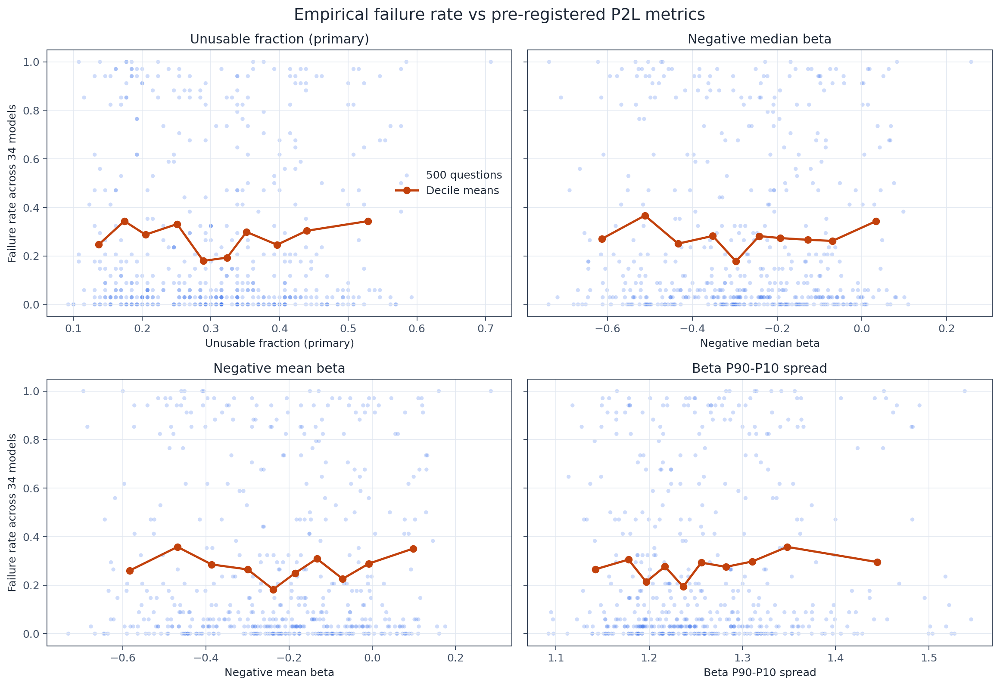
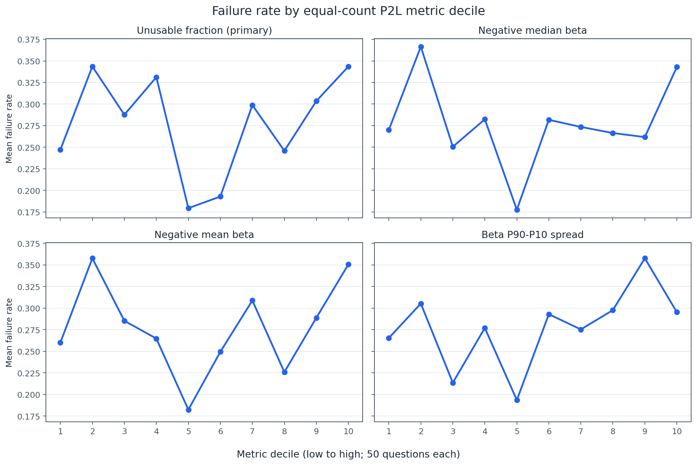
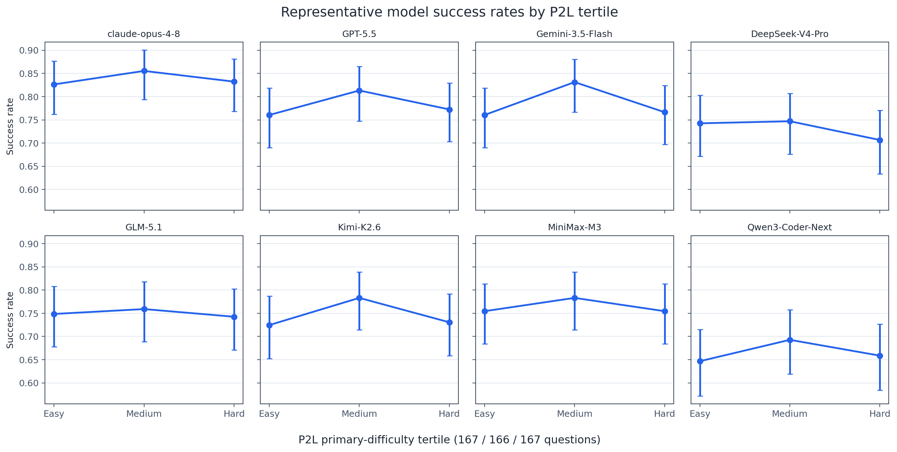
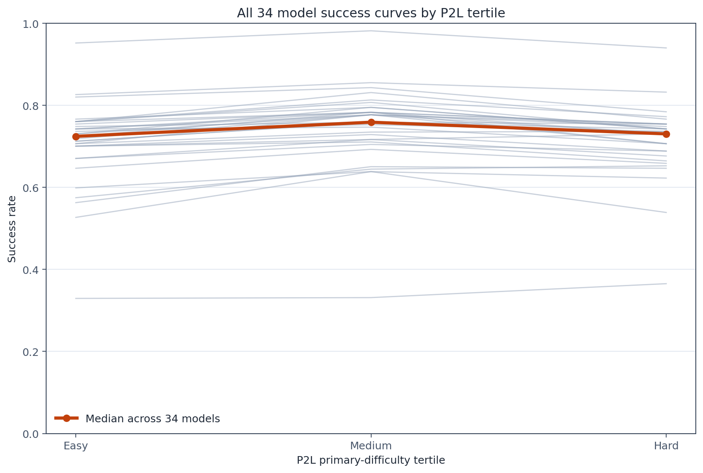
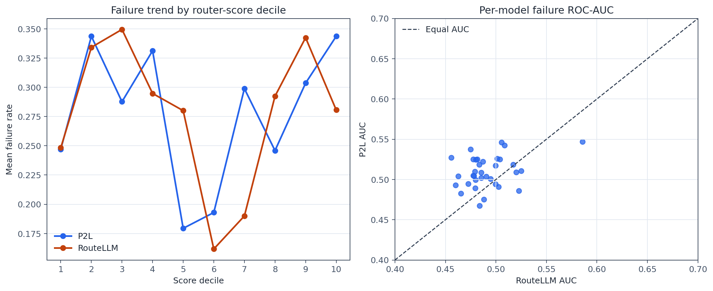
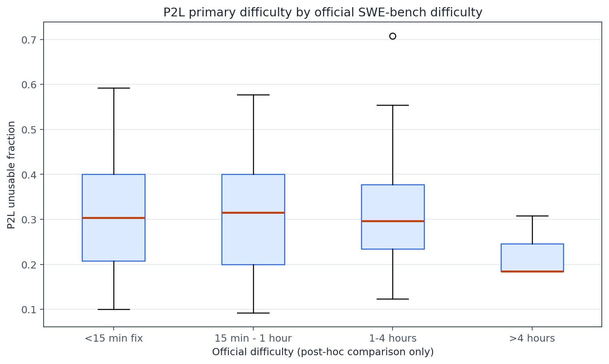

# Phase 1C: P2L difficulty validity on SWE-bench Verified

## Technical summary

**The pre-registered P2L primary metric does not provide a valid SWE-bench difficulty ordering in this experiment.** Across 500 questions, `p2l_unusable_fraction = count(beta_i <= 0) / 130` has Spearman ρ = **-0.0074** with the empirical failure rate of 34 OpenHands models; the 10,000-resample question bootstrap 95% interval is **[-0.0967, 0.0834]**. None of the 34 model curves satisfies `Easy >= Medium >= Hard`, and the median Easy-to-Hard success-rate change is **-0.60 percentage points**: the nominal Hard group is slightly easier, not harder, at the median.

P2L is not clearly better than the Phase 1B RouteLLM baseline. The paired difference `P2L Spearman - RouteLLM Spearman` is **-0.0125**, with 95% CI **[-0.1126, 0.0896]**. P2L has the higher per-model failure ROC-AUC for 26/34 models and a higher median AUC (0.509 versus 0.486), but this does not overcome its null aggregate correlation, zero monotonic curves, or reversed median tertile effect. The automatic conclusion is therefore **not support**.

This is a negative transfer result for one frozen 135M P2L model on software-engineering issue text. It does not establish that larger P2L models or a SWE-specific trained model would fail. It does establish that the tested checkpoint should not advance to a ClawRouter difficulty or cost-routing stage on the present evidence.

The run used no commercial model API, GPU, quantization, answer generation, gold patch, test patch, OpenHands trajectory, outcome, cost, or official difficulty as P2L input. No production TypeScript, proxy, frontend, or routing code was changed.

## The primary signal is unrelated to observed failure



Each panel shows one pre-registered metric. Every point is one Verified question; the y-axis is the fraction of 34 OpenHands evaluations not resolved successfully. Orange lines show equal-count decile means. None of the four panels has a stable positive relationship. The primary unusable-fraction panel controls the conclusion; the other three remain auxiliary.



Each panel contains ten 50-question groups under that metric's own stable ordering. All four trends are non-monotonic: middle deciles often contain the lowest failure rates, while both low and high deciles contain elevated failure. For the primary metric, six of nine steps rise, but their magnitude and intervening reversals do not yield a positive rank correlation.

## All model curves fail the monotonic criterion



All eight pre-specified representative models peak in the Medium bin. Error bars are Wilson 95% intervals. The pattern is not caused by selecting only the display models: all 34 models enter the full analysis, and zero satisfy `Easy >= Medium >= Hard`.

| Model | Easy | Medium | Hard | Easy→Hard decline |
|---|---:|---:|---:|---:|
| `claude-opus-4-8` | 82.6% | 85.5% | 83.2% | -0.60 pp |
| `GPT-5.5` | 76.0% | 81.3% | 77.2% | -1.20 pp |
| `Gemini-3.5-Flash` | 76.0% | 83.1% | 76.6% | -0.60 pp |
| `DeepSeek-V4-Pro` | 74.3% | 74.7% | 70.7% | 3.59 pp |
| `GLM-5.1` | 74.9% | 75.9% | 74.3% | 0.60 pp |
| `Kimi-K2.6` | 72.5% | 78.3% | 73.1% | -0.60 pp |
| `MiniMax-M3` | 75.4% | 78.3% | 75.4% | 0.00 pp |
| `Qwen3-Coder-Next` | 64.7% | 69.3% | 65.9% | -1.20 pp |



The all-model view confirms the common Medium-bin increase. The highlighted median curve moves from 72.3% to 75.9% to 72.9%, so the nominal difficulty ordering does not behave as an ordinal challenge scale.

## P2L does not clearly improve on RouteLLM



The left panel compares each method's independently ranked deciles using the same 500 questions and success labels. Neither trend is monotonic. The right panel shows that P2L often improves per-model AUC relative to RouteLLM, but most values remain close to random discrimination. The primary comparison is the pre-specified paired Spearman difference, whose interval includes zero and favors neither method conclusively.

| Comparison | P2L | RouteLLM | P2L minus RouteLLM |
|---|---:|---:|---:|
| Overall failure Spearman | -0.0074 | 0.0051 | -0.0125 |
| Monotonic models | 0/34 | 1/34 | -1 |
| Median Easy→Hard decline | -0.60 pp | 0.60 pp | -1.20 pp |
| Median model failure AUC | 0.509 | 0.486 | 0.023 |

The paired Spearman-difference CI is `[-0.1126, 0.0896]`. Phase 1B files were read without modification; P2L used identical questions, outcomes, null convention, 167/166/167 group sizes, bootstrap count, and decision rule.

## Official difficulty does not validate the P2L ordering



P2L primary difficulty has Spearman ρ = **0.0163** with the ordered official label. The Kruskal-Wallis comparison gives `p = 0.5842`. The `>4 hours` category contains only three questions, so its narrow-looking box is not strong evidence; official difficulty is a post-hoc comparison rather than an input or sole ground truth.

## Scope, inputs, and metric definitions

The analysis uses the frozen Phase 1A matrix: 500 unique SWE-bench Verified questions, 34 OpenHands models, and 17,000 model-question outcomes. All models cover the same 500 instances. P2L receives exactly one user turn containing the original `problem_statement`. The script does not load OpenHands outcomes until all 500 P2L outputs are cached.

The primary empirical label is:

```text
success = resolved is true
failure = resolved is false or null
empirical_failure_rate = failures / 34
```

The nine null outcomes remain flagged. A sensitivity analysis excludes them from each affected question/model denominator.

The frozen P2L metrics are:

```text
p2l_difficulty_primary    = count(beta_i <= 0) / count(beta_i)
p2l_difficulty_neg_median = -median(beta_i)
p2l_difficulty_neg_mean   = -mean(beta_i)
p2l_beta_spread           = percentile_90(beta_i) - percentile_10(beta_i)
```

Only `p2l_difficulty_primary` controls bins and the experiment conclusion. Its distribution is min 0.0923, P25 0.2077, median 0.3077, mean 0.3095, P75 0.4000, and max 0.7077, with 67 distinct values. Ties are ordered by `instance_id`, as pre-specified, to produce exactly 167 Easy, 166 Medium, and 167 Hard questions.

The three auxiliary metrics also fail to show a stable positive association: ρ is -0.0157 for negative median beta, -0.0102 for negative mean beta, and 0.0398 for beta spread; every 95% interval includes zero. They are reported without promoting any auxiliary metric to primary status.

## Frozen P2L model and official implementation

| Component | Frozen value |
|---|---|
| Official code | [`lmarena/p2l`](https://github.com/lmarena/p2l), commit `a905fa5ea94a75fdf157d73e27bd3c63ac1ebeb1` |
| Hugging Face model | [`lmarena-ai/p2l-135m-grk-01112025`](https://huggingface.co/lmarena-ai/p2l-135m-grk-01112025) |
| Model/tokenizer revision | `2b642ae1ce114fb54e468e4c676f122135bcf11b` |
| Architecture | Llama, Grounded Rao-Kupper regression head |
| Parameters | 134,591,171 |
| Model file SHA-256 | `1ac660b56b95e08fdc48523423c23d8c21d50cd65005d079c781e0cdffba4790` |
| `model_list.json` | 130 models; SHA-256 `7a4e145dbbe841b986d570e5be36fd634f7451f9f0676599cf465cac32601e52` |
| Tokenizer SHA-256 | `1c704200f743419b33efaebdff006385c093916fa0e1907f09e2b665b4c03ccc` |
| Context | 8,192 tokens; official left truncation |

The script imports the official `get_p2l_model("llama", "bag", "rk")` factory and preserves its Llama body, CLS selection, beta head, eta head, and output formula. No compatibility patch, structural change, retraining, fine-tuning, or quantization was needed. The model runs in FP32 on CPU with four Torch threads, batch size 1, `low_cpu_mem_usage=True`, `model.eval()`, and `torch.inference_mode()`.

## Tokenization and truncation

The official tokenizer's `model_max_length` is 8,192 and `truncation_side` is `left`. Each question is passed through the official one-user-turn chat template without a generation prompt; `<|cls|>` is appended exactly as in the official inference code. No task instruction or “judge difficulty” prompt is added.

Across 500 inputs, token counts are min 33, P25 202.75, median 374.5, mean 564.98, P75 667.25, P95 1,584.8, and max 9,212. Exactly **one question (0.2%)**, `pylint-dev__pylint-7080`, is truncated to 8,192 tokens using the official left-truncation behavior. No summarization is performed.

## CPU preflight and full inference

The fixed preflight uses the first 20 questions under stable `instance_id` sort and does not load outcomes. It passed the 7 GiB gate:

| Measure | Observed |
|---|---:|
| Model load | 1.05 s |
| Available memory before load | 19.34 GiB |
| RSS before load | 0.40 GiB |
| RSS after load | 0.98 GiB |
| Peak preflight RSS | 1.27 GiB |
| Twenty-question inference | 52.81 s |
| Single-question p50 / p95 | 1.97 / 6.05 s |
| Output dimension | 130 |
| Finite outputs | 20/20 |
| Repeated first-question difference | exactly 0 for beta and eta |

Across the full 500-question cache, summed single-question inference time is **865.06 seconds (14.42 minutes)**. Single-question p50/p95 is **1.01/5.06 seconds**, with maximum 43.89 seconds. These timings exclude model loading, statistics, plotting, and filesystem overhead.

## Statistical design and robustness

For each metric, Spearman correlation is computed against question-level empirical failure. Confidence intervals use 10,000 question-level bootstrap resamples with seed `20260726`. Per-model outputs include Wilson 95% intervals, Easy-to-Hard change, monotonicity, difficulty/success and difficulty/failure Spearman correlations, and failure ROC-AUC.

The automatic rule is unchanged from Phase 1B:

- **Support:** primary Bootstrap lower bound > 0, at least two thirds of models monotonic, and median Easy-to-Hard decline > 0.
- **Partial support:** positive primary point estimate and upper bound, at least half of models monotonic, and median decline > 0.
- **Not support:** otherwise.

Excluding nine null outcomes changes the primary ρ from -0.0074 to -0.0049, leaves the monotonic count at 0/34, leaves the median decline at -0.60 pp, and does not change the conclusion.

All 500 beta vectors and eta values are finite and have dimension 130, matching `model_list.json`. The online inference run and a credential-free, network-free cache replay produced byte-identical Parquet, CSV, JSON analysis, hardware benchmark, and PNG files. `run_manifest.json` records the final `offline_replay` execution mode.

## Limitations and uncertainty

- The 135M checkpoint is small and was trained on Chatbot Arena preference prompts, not SWE-bench issue resolution. Domain and outcome mismatch are plausible explanations for the null transfer.
- OpenHands success reflects both the language model and the evaluated agent version; it is not a model-only capability label.
- Beta zero is grounded as a usability boundary by the model family, but the observed 67-value primary score has ties. Stable ID tie-breaking makes the tertiles reproducible but cannot add information within a tie.
- Official difficulty is imbalanced, especially the three-question `>4 hours` category.
- Per-model AUC is descriptively better than RouteLLM for many models, but no multiple-comparison or paired-AUC uncertainty claim is made. The pre-registered aggregate and curve criteria remain controlling.
- The experiment validates ranking only. It does not evaluate routing utility, latency-aware policies, or cost.

## Recommended next steps

Do not advance this checkpoint to RouteLLM difficulty validation or production routing. If P2L remains of interest, pre-register a separate experiment using a larger official P2L checkpoint under the same 500-question labels, input isolation, bins, and paired comparison. Do not select the next checkpoint based on auxiliary metrics from this run. A SWE-domain model would require training and a new phase rather than being presented as a continuation of this frozen validation.

## Further questions

- Does P2L model size improve SWE-bench transfer monotonically under the same primary metric?
- Is the failure caused mainly by domain shift, the binary usability threshold, or agent/model version confounding?
- Would a separately pre-registered continuous P2L metric improve discrimination without post-hoc metric selection?

## Reproduce

From this directory:

```bash
python3 -m venv .cache/venv
.cache/venv/bin/python -m pip install -r requirements.txt
.cache/venv/bin/python scripts/run_p2l_validation.py --mode preflight
.cache/venv/bin/python scripts/run_p2l_validation.py --mode full
.cache/venv/bin/python scripts/run_p2l_validation.py --mode full --offline
```

The first two commands may download only the official public P2L Git repository and Hugging Face model snapshot. No commercial API key is read. The offline command forbids downloads and requires all pinned assets and 500 cached outputs. Missing assets, hash changes, wrong dimensions, non-finite values, an incomplete cache, failed memory gate, duplicate data, or inconsistent question sets cause a non-zero exit.

Large model files, official repository checkout, environment, and per-question caches live under ignored `.cache/`.

## Delivered files

- `scripts/run_p2l_validation.py`: CPU inference, caching, analysis, comparison, figures, and validation.
- `outputs/p2l_raw_outputs.parquet`: all 500 complete beta vectors and eta values.
- `outputs/question_p2l_scores.csv`: per-question token, truncation, primary/auxiliary score, eta, rank, and bin fields.
- `outputs/question_empirical_difficulty.csv`: per-question 34-model outcomes joined after inference.
- `outputs/model_difficulty_curves.csv`: 34 × 3 curve rows with Wilson intervals.
- `outputs/model_validity_metrics.csv`: all 34 model correlations, AUCs, drops, and monotonicity.
- `outputs/p2l_vs_routellm.csv`: aggregate, decile, paired-bootstrap, and per-model AUC comparison records.
- `outputs/null_sensitivity_analysis.csv`: primary versus null-excluded aggregate and model results.
- `outputs/hardware_benchmark.json`: preflight gate and full latency summary.
- `outputs/run_manifest.json`: revisions, hashes, model list, runtime, inputs, parameters, and chart map.
- `outputs/aggregate_validation.json`: machine-readable findings and conclusion.
- `outputs/figures/`: six figures generated only from committed CSV files.
